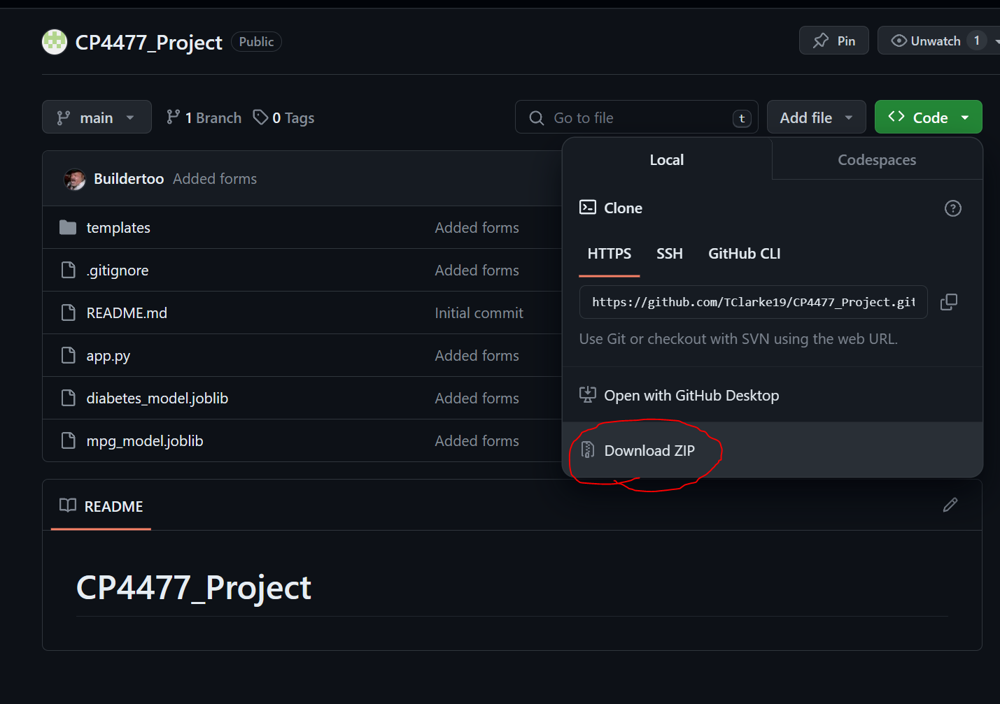

## CP4477_Project

### Instructions for running the web app:

    -Clone the github repo (https://github.com/TClarke19/CP4477_Project), 
    or click the green "<> Code" buttons to display the dropdown menu, 
    and download the .zip file from github.
    

    -Unzip the .zip file and open the extracted folder in an IDE text editor.

    -Run the file called app.py; a terminal should populate with a link to open the renedered wep app. 
        (hint: the terminal oputput with the link should be similar to "Running on http://127.0.0.1:5000/ (Press CTRL+C to quit)").

    -Hover your cursor over the link "http://127.0.0.1:5000/", or simply click it to open it in a web browser of your choice.